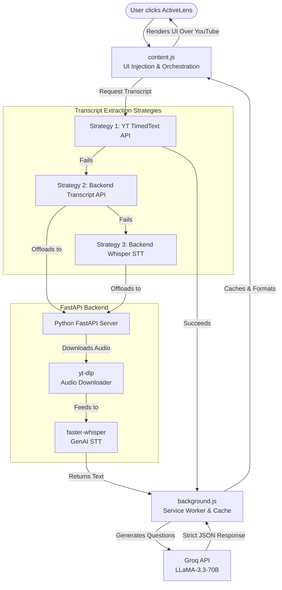

# 🎓 ActiveLens

ActiveLens is a powerful Google Chrome Extension that transforms any YouTube video into an interactive learning experience. It dynamically extracts transcripts, processes them through an ultra-fast LLaMA-3.3 Large Language Model (via Groq), and overlays context-aware, multiple-choice quizzes directly onto the video player.

---

## 🏗️ System Architecture & Tech Stack

The architecture is split into a lightweight Client-Side **Chrome Extension** and a robust Python **FastAPI Backend** designed to handle failsafe transcription.



---

## 🛠️ Detailed Technology Stack

### 1. Frontend: Chrome Extension (Manifest V3)
* **Languages:** Vanilla JavaScript (ES6+), HTML5, CSS3
* **Implementation:** 
  * `content.js`: Acts as the orchestrator. It listens for user triggers, scrapes video Metadata/URLs, and injects the `quiz-ui.js` React-like rendering components directly into the YouTube DOM hierarchy without breaking the native player.
  * `quiz-ui.js`: Handles interactive state (tracking correct answers, rendering feedback, passing to the next question).
  * `Chrome Storage API`: Aggressively caches generated quizzes and transcripts locally so returning to a video loads instantly and saves API rate limits.

### 2. Service Worker & AI Pipeline
* **Technologies:** Service Worker (`background.js`), Groq API, LLaMA-3.3-70b-versatile
* **Implementation:**
  * Runs entirely independently in the background. It intercepts requests from the content script and manages the core data flow.
  * We utilize **Groq**, an inference engine known for massive token-per-second outputs. We prompt `LLaMA-3.3` to act as an educational agent.
  * **Strict Data Parsing:** Uses a highly customized `safeParse()` fallback function to enforce that the LLM consistently returns a strictly formatted JSON array, circumventing markdown hallucinations.

### 3. Failsafe Transcript Layer (`transcript.js`)
* **Strategy 1 (Primary):** Reaches into YouTube's hidden `timedtext` API to grab native Closed Captions with extremely low latency.
* **Strategy 2 & 3 (Failsafes):** If videos have captions disabled, or are region-locked, it falls back to the Python backend to brute-force the extraction.

### 4. Backend Server
* **Technologies:** Python 3, FastAPI, Uvicorn
* **Implementation:**
  * An asynchronous local server (`localhost:8000`) heavily fortified to deal with intense data tasks to avoid freezing the browser thread.
  * `youtube-transcript-api`: A Python library that bypasses browser-side CORS and cookie issues to fetch standard transcripts.

### 5. Whisper Speech-To-Text (GenAI)
* **Technologies:** `faster-whisper`, `yt-dlp`
* **Implementation:**
  * When a video has **no subtitles whatsoever**, backend STT handles the final fallback.
  * `yt-dlp` dynamically rips the audio stream from the YouTube video.
  * `faster-whisper` (a highly optimized CTranslate2 version of OpenAI's Whisper) transcribes the audio chunk-by-chunk using hardware acceleration.

---

## 🚀 Setup & Installation

### Backend Setup
```bash
cd backend
python -m venv venv
.\venv\Scripts\activate      # Windows
# source venv/bin/activate   # Mac/Linux
pip install -r requirements.txt
python -m uvicorn main:app --reload --port 8000
```

### Extension Setup
1. Open Chrome and navigate to `chrome://extensions/`
2. Enable **Developer Mode** in the top right.
3. Click **Load unpacked** and select the `extension` folder in this repository.
4. Open any YouTube video and click the ActiveLens icon!
